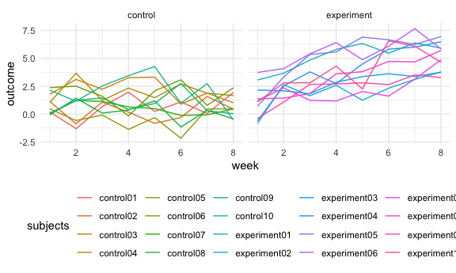

homework 5
================

# Problem 1

``` r
homocide_df = read.csv("data/homicide-data.csv",na = c("", "Unknown")) %>% 
  mutate(
    city_state = str_c(city, state),
    resolution = case_when(
      disposition == "Closed without arrest" ~ "unsolved",
      disposition == "Open/No arrest" ~ "unsolved",
      disposition == "Closed by arrest" ~ "solved"
    )) %>% 
  relocate(city_state) %>% 
  filter(city_state != "TulsaAL")
```

``` r
homocide_df %>% 
  count(city_state, resolution) %>% 
  head()
```

    ##      city_state resolution    n
    ## 1 AlbuquerqueNM     solved  232
    ## 2 AlbuquerqueNM   unsolved  146
    ## 3     AtlantaGA     solved  600
    ## 4     AtlantaGA   unsolved  373
    ## 5   BaltimoreMD     solved 1002
    ## 6   BaltimoreMD   unsolved 1825

### Let’s focus on Baltimore

``` r
baltimore_df =
  homocide_df %>% 
  filter(city_state == "BaltimoreMD")

baltimore_summary =
  baltimore_df %>% 
    summarize(
      unsolved = sum(resolution == "unsolved"),
      n = n()
    )

baltimore_test = 
  prop.test(
    x = baltimore_summary %>% pull(unsolved),
    n = baltimore_summary %>% pull(n)
  )

baltimore_test %>% 
  broom::tidy() %>% 
  select(estimate, contains("conf"))
```

    ## # A tibble: 1 × 3
    ##   estimate conf.low conf.high
    ##      <dbl>    <dbl>     <dbl>
    ## 1    0.646    0.628     0.663

``` r
prop_test_function = function(city_df){
  
  city_summary =
    city_df %>% 
      summarize(
        unsolved = sum(resolution == "unsolved"),
        n = n()
      )

  city_test = 
    prop.test(
      x = city_summary %>% pull(unsolved),
      n = city_summary %>% pull(n)
    )
  
  return(city_test)
}

prop_test_function(baltimore_df)
```

    ## 
    ##  1-sample proportions test with continuity correction
    ## 
    ## data:  city_summary %>% pull(unsolved) out of city_summary %>% pull(n), null probability 0.5
    ## X-squared = 239.01, df = 1, p-value < 2.2e-16
    ## alternative hypothesis: true p is not equal to 0.5
    ## 95 percent confidence interval:
    ##  0.6275625 0.6631599
    ## sample estimates:
    ##         p 
    ## 0.6455607

iterate across all cities

``` r
result_df =
  homocide_df%>% 
    nest(data = uid:resolution) %>% 
    mutate(
      test_results = map(data, prop_test_function),
      tidy_results = map(test_results, broom::tidy)
    ) %>% 
  select(city_state, tidy_results) %>% 
  unnest(tidy_results) %>% 
  select(city_state, estimate, contains("conf"))
```

plot of estimate and confidence interval

``` r
result_df %>% 
  mutate(city_state = fct_reorder(city_state, estimate)) %>%
  ggplot(aes(x = city_state, y = estimate)) +
  geom_point() +
  geom_errorbar(aes(ymin = conf.low, ymax = conf.high)) +
  theme(axis.text.x = element_text(angle = 90, vjust = 0.5, hjust = 1))
```


## Problem 2

### import data

``` r
all_df=
  tibble(
    files=list.files("data/longitudinal_study"),
    path=str_c("data/longitudinal_study/", files)
  ) %>% 
  mutate(data=map(path,read_csv)) %>% 
  unnest()
```

### clean data

``` r
tidy_df=
  all_df %>% 
    select(-path) %>% 
    mutate(files=str_replace(files,".csv","")) %>% 
    separate(files,into=c("group","ID"),sep="_") %>% 
    mutate(group=str_replace(group,"con","control")) %>% 
    mutate(group=str_replace(group,"exp","experiment")) %>% 
    pivot_longer(
      week_1:week_8,
      names_to = "week",
      values_to ="outcome"
    ) %>% 
    mutate(week=str_replace(week,"week_",""),files=str_c(group,ID),ID=as.numeric(ID),week=as.numeric(week)) %>% 
    rename(subjects=files)%>% 
    select(subjects,everything())
```

### make a spaghetti plot

``` r
tidy_df%>% 
  ggplot(aes(x=week,y=outcome)) + geom_line(aes(color=subjects)) + facet_grid(~group)
```



As shown in the plot,in the control group,the outcome of 10 subjects do
not change a lot after 8 weeks.However,the outcome of 10 subjects in the
experiment group increase in a roughly simple linear way.

## Problem 3

``` r
set.seed(10)

iris_with_missing = iris %>% 
    map_df(~replace(.x, sample(1:150, 20), NA)) %>%
    mutate(Species = as.character(Species)) %>% 
    janitor::clean_names() 


fill_missing=function(x){
    if(is.numeric(x)){
      replace_na(x,mean(x,na.rm=TRUE))
    }
  else if(is.character(x)){
      replace_na(x,"virginica")
  }

}

iris_without_missing=map_df(iris_with_missing,fill_missing)
```
